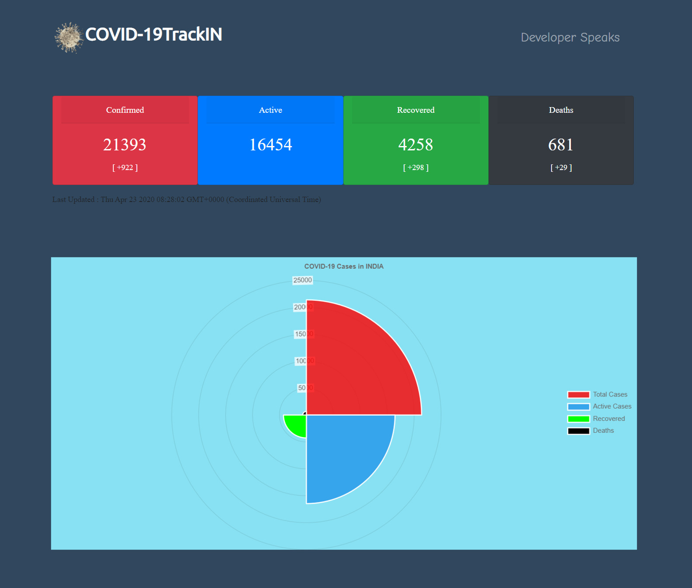

# [COVID-19Track.IN](http://covid-19track.in)




## Setup

```javascript
npm i && npm start
```
After setup, server will start on port `3000` which can be accessed through <http://localhost:3000/>

<br>

## API
<https://covid19-mohfw.herokuapp.com/> 

Data is collected from [MoHFW](https://www.mohfw.gov.in/) through this [API](https://covid19-mohfw.herokuapp.com/)

<br>

     
## Developer
[COVID-19Track.IN](http://covid-19track.in) is developed by [SandeepKrSuman](https://www.linkedin.com/in/sandeepkrsuman/)

  <br><br>
## #StayHome #StaySafe
Stay safe and explore yourself. Add something new to your interest. 
Meanwhile you can contribute to this opensource. 🙂
